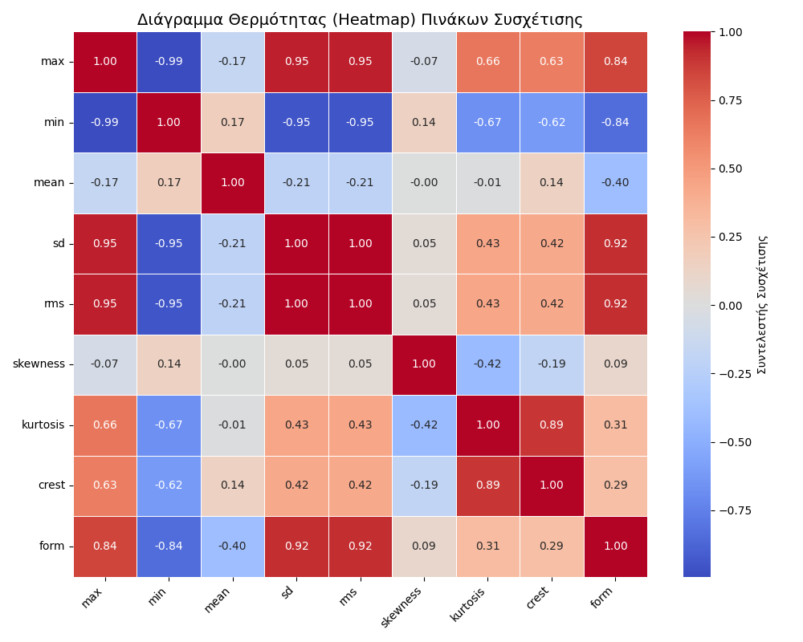

# Robotic Predictive Maintenance with Machine Learning

This project focuses on developing a predictive maintenance system for robots, using sensor data and machine learning techniques to determine when a robot might need maintenance. The main application is industrial maintenance, where robots are used in critical processes, and their maintenance must be accurate and timely.

## Contents

- [Introduction](#introduction)
- [Requirements](#requirements)
- [Installation and Execution](#installation-and-execution)
- [Usage](#usage)
- [System Architecture](#system-architecture)
- [Learning Strategies](#learning-strategies)
- [Visualizations](#visualizations)

## Introduction

The project uses sensor data (such as RMS, skewness, kurtosis, etc.) and analyzes the data using machine learning techniques (such as Random Forest) to predict when a robot will need maintenance. Principal Component Analysis (PCA) is also applied for dimensionality reduction of the data.

## Requirements

To run the project, you need to install the following libraries:

- Python 3.x
- Pandas
- NumPy
- Scikit-learn
- Matplotlib
- Seaborn
- Joblib

You can install the required libraries using the command:

```bash
pip install -r requirements.txt

System Architecture:
The system includes the following steps:
Data Loading: Data is loaded from a CSV file and stored in a DataFrame.
Data Preparation: Columns containing the 'fault' label are isolated and used for model training.
Model Training: The model is trained using the Random Forest algorithm to predict maintenance needs.
Evaluation and Visualizations: The confusion matrix, feature importances, and histograms are generated to evaluate the model.


Learning Strategies:
The project employs the following machine learning techniques:
Random Forest Classifier: Used for classifying the data and predicting robot failures.
Principal Component Analysis (PCA): Applied to reduce the dimensionality of the data and improve model performance.


## Heatmap of Feature Correlations

The following heatmap shows the correlation matrix of the features used in the predictive maintenance model. It helps to visualize how each feature relates to the others, which can be important for understanding the relationships between them.

- **max** and **min** features have a strong negative correlation (-0.99), indicating that when one increases, the other tends to decrease.
- **mean**, **sd**, **rms**, **kurtosis**, and **crest** are positively correlated, suggesting they may share similar trends in their values.
- Features such as **skewness** and **form** show weaker correlations with others, which may indicate that they carry different information.



The heatmap is an essential tool for exploring the data before training the model, as it helps identify which features are more or less related. This information can assist in feature engineering, selection, and improving the model's performance.


Visualizations
Confusion Matrix Heatmap

The following heatmap shows the confusion matrix of the model's performance, illustrating how the model classifies the robot's maintenance needs:

Correlation Heatmap

The following heatmap shows the correlation matrix of the features used in the predictive maintenance model. It helps to visualize how each feature relates to the others.

max and min features have a strong negative correlation (-0.99), indicating that when one increases, the other tends to decrease.

mean, sd, rms, kurtosis, and crest are positively correlated, suggesting they may share similar trends in their values.

Features such as skewness and form show weaker correlations with others, which may indicate that they carry different information.
